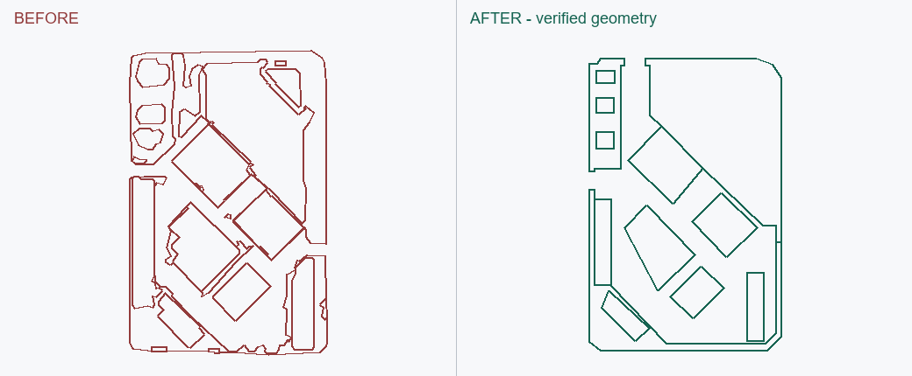

# EF001 · 碎地块与细缝通道

触发：碎面、细缝、三角、小地块、封面、净宽。

## 错误做法

把轮廓细描边当道路/地块，保留全部残三角；数值上连通就认为道路可用。

## 正确处理与检查

先从源图确定入口与可用净宽；道路优先，次要小块归并。check_region_faces 在旧版和修正版运行同一条件；检查净宽腐蚀后的连通、碎面、短边和完整线网。

## 不可照搬的情况

真实窄巷、分隔绿带、院落不能按面积自动吞并；不同层级道路不能强连。

## 已有案例与状态

### EF001-A

第三个场景的街坊：旧版同面成立但净宽检查失败，33 处碎面/短边候选；局部修后同一合同通过，范围外几何保持。实际软件内封面仍待复测。

状态：`geometry_verified`；SU：`not_run`。此状态只属于该变体及文件版本。

实际历史 CAD 的局部重绘，左右同一裁剪范围与尺度；不含底图，不是新修复或原生 SU 截图。

关联流程：[region-face-check](../../region-face-check.md)、[su-plan-contract](../../su-plan-contract.md)。
