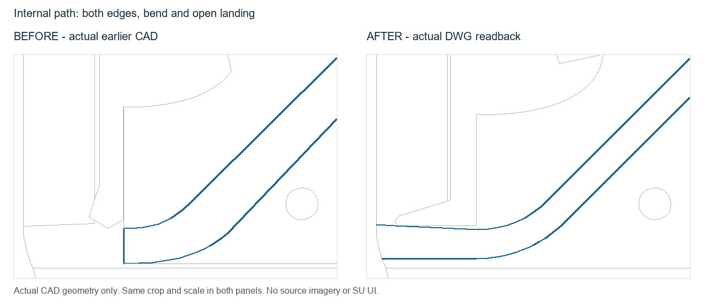
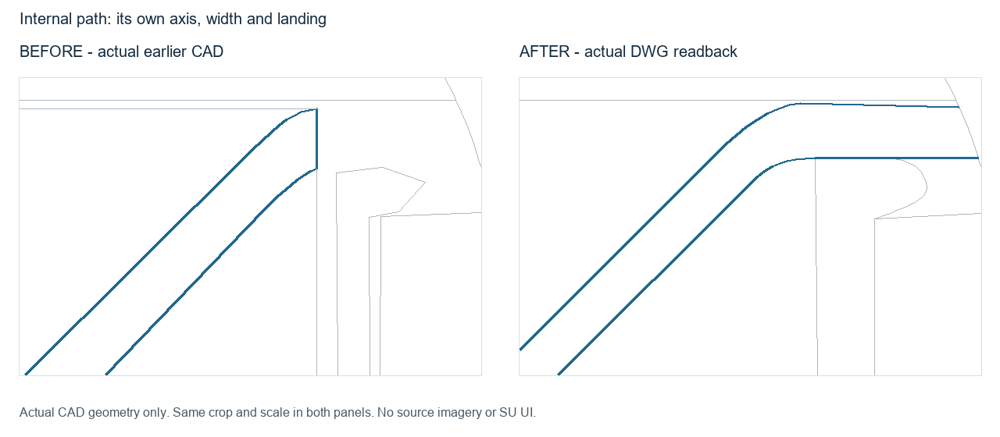
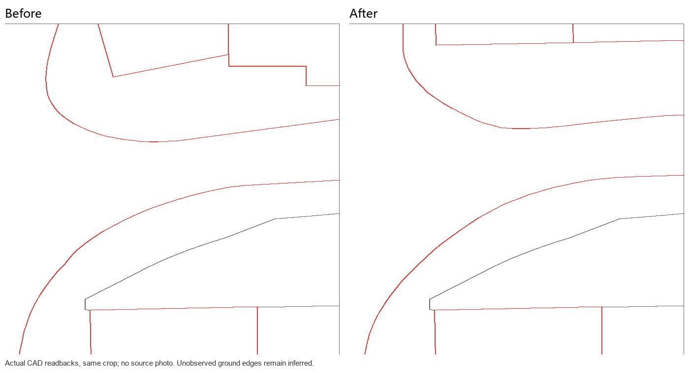

# EF002 · 全局探针不能代替局部覆盖

触发：漏检、覆盖、候选、主干路、局部、内部步道、双侧、法向宽度、转弯、端部接续。

## 错误做法

只检查主干路几个点，或只列已知异常对象，随后宣称全图建筑和街坊检查完成。

## 正确处理与检查

建立全部应保留建筑的清单，包括无法自动检查的曲线/共边对象。候选逐项作 keep / regularize / separate_ground / defer；用户点名区域必检。每轮保存建筑总数、已筛数、处置数和待查数，缺项不能称完成建筑验收。

## 不可照搬的情况

候选数量不是错误楼数；无自动触发的对象也可能被错分为建筑。几何统计需配合按街坊查看原图及形体。

## 已有案例与状态

### EF002-A

第三个场景全图线网通过，但街坊内部未覆盖；新增局部检查在原文件复现失败。

状态：`geometry_verified`；SU：`not_run`。此状态只属于该变体及文件版本。

实际历史 CAD 的局部重绘，左右同一裁剪范围与尺度；不含底图，不是新修复或原生 SU 截图。

### EF002-B

用户再次指出其他小建筑形态夸张。本次只归档规则和待处理问题，没有修图，也没有给这些楼补造修改后图。

状态：`pending`；SU：`not_run`。此状态只属于该变体及文件版本。

关联流程：[building-regularization](../../building-regularization.md)、[acceptance](../../acceptance.md)。

## EF002-C · 中小尺度内部步道覆盖

实际旧版外环与总体线网检查不能覆盖内部步道：两段双侧边、法向宽度、弯段/平台接续均须独立查看；父矩形裁剪还在入口生成假横向封口。按原图分别恢复各段轴向、宽度、弯段与端部，调整平台共边，外环和建筑保留回归基线。

对同一旧/新实际 CAD 回放的 10 项道路检查，旧版 9 项失败，最终 DWG 回读 10 项通过；另有绿地 2 项见 EF011。道路检查包含四侧边采样、两处法向宽度、两组同面关系及两处横向干扰检查。转弯还有项目原图视觉复核，不将有限采样说成每一点精确。

状态：`geometry_verified`；`user_acceptance: pending`；`native_sketchup: not_run`。旧版及本修订版均无用户已验收声明。旧局部通过结论已被反馈重开；旧证据保留为 superseded，不撤销未涉及的外环/建筑基线。

图为实际旧 CAD 与新 DWG 回读线网局部重绘，前后同裁剪范围和尺度。强调色仅帮助看边线，不是用户蓝色批注或原图真值。可迁移的是 [逐段检查记录](../../site-detail-checks.md)，不是图中轴线、方位、宽度、面数或项目容差。大尺度未授权区域不新增内部逐段精修。

## EF002-D · 细节通过后仍漏检相邻路口对象

用户再次指出同一中小尺度成果局部有问题。既有绿地与内部步道检查通过，不能代替相邻路口两侧路缘、画幅边建筑基底及铺装归属的覆盖。应用既有 R01/R02/R06/R10 和逐对象检查，先用未标注原图登记独立期望，再重放旧/新实际 DWG 回读。

7项局部检查旧5项失败、新7项通过；原12项内部细节检查仍通过。修正两侧路缘和两组裁切建筑，保留其余几何。绿地新增可见边采样通过，因此没有为了用户指出方位就无依据改形；屋顶下南边仍为推断和 pending。

这是既有机制执行覆盖不足的复发记录；本轮未修改通用判断规则来获得通过。规则存在不等于已执行完整，也不能由有限采样推断遮挡边精确。

状态：`geometry_verified`（仅已执行检查）；`user_acceptance: pending`；`native_sketchup: not_run`。旧局部结论 superseded；未涉及对象保留基线。

实际旧/新 DWG 回读局部重绘，前后同范围同尺度，无用户原图。颜色仅强调道路和建筑，不是通用语义答案。项目方位、坐标、面数和量测容差不迁移。
