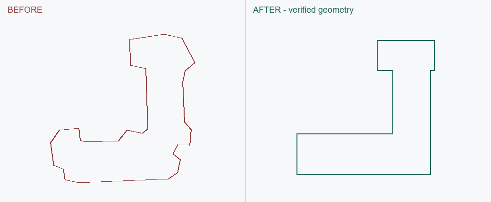
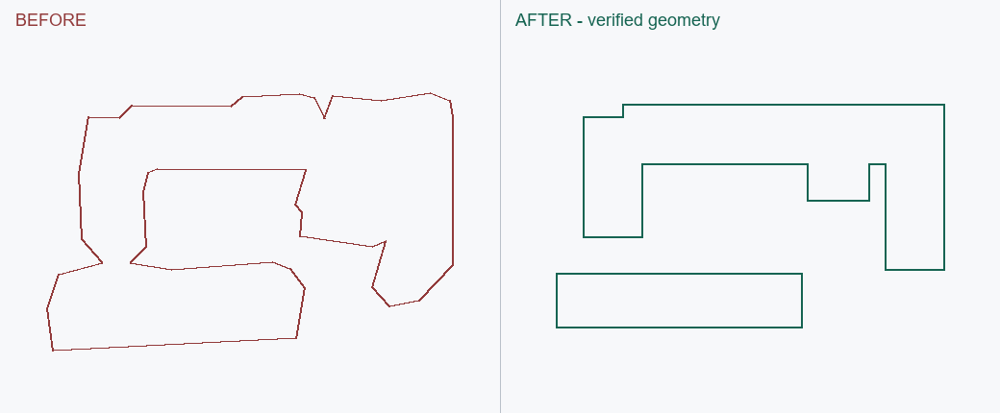

# EF005 · 异常建筑碎角、拖尾和铺装串楼

触发：建筑、畸形、夸张、碎角、尖刺、拖尾、铺装、小建筑。

## 错误做法

小建筑就照搬栅格碎角；建筑与铺装连成夸张多边形；路网通过后跳过建筑复核。

## 正确处理与检查

完整筛查应保留建筑，核对源图屋面/基底和轴向。去掉无结构的尖角、尾巴及地面串联，必要时拆楼；正常建筑不改。候选处理必须记账，随后查邻块、全部道路和回读几何。

## 不可照搬的情况

保留真实 L/U、斜翼、有盖连接和院落；低清楚度不是自动删楼或一律矩形化的依据。

## 已有案例与状态

### EF005-A

第一个场景：清楚的 L 形屋面边缘夸张，按自身轴向整理翼部；历史修复有几何及 DWG 回读证据。

状态：`geometry_verified`；SU：`not_run`。此状态只属于该变体及文件版本。

实际历史 CAD 的局部重绘，左右同一裁剪范围与尺度；不含底图，不是新修复或原生 SU 截图。

### EF005-B

第一个场景的不同变体：无盖地面把南侧单体和 U 形楼串联。拆开单体并保留院落，比单纯减点多了类别与连接修正。

状态：`geometry_verified`；SU：`not_run`。此状态只属于该变体及文件版本。

实际历史 CAD 的局部重绘，左右同一裁剪范围与尺度；不含底图，不是新修复或原生 SU 截图。

### EF005-C

第二个场景历史记录还发现建筑混入相邻绿地楔形；第三个场景又收到小建筑形态夸张反馈。重复说明执行覆盖不足。第三个场景相关异常目前尚未逐栋定位和修复。

状态：`pending`；SU：`not_run`。此状态只属于该变体及文件版本。

### EF005-D · 阴影下建筑被漏判为铺装

城市路口测试中，一栋建筑的北侧范围被留作白色铺装，旧外环将建筑截短。用户给出近似边界，并指出可能受阴影影响。源图中建筑与邻近高层阴影重叠支持这一解释，但不能由输出反推模型内部成因已经证实。

处理：核对明暗两侧屋面/檐口及墙体方向连续性、接地边和相邻通道；按用户本轮修订范围补回漏识别建筑部分，删除旧分界，形成单一建筑外环，仅修相邻接边。蓝线用于说明范围，不照搬手绘抖动，也不作为测绘标尺。

检查：新建筑包含本轮指出的漏识别部分；旧边不横穿新建筑；主路、人行空间、邻地及其他建筑保持本轮基线关系。实际图像修订已生成并作局部视觉检查；新图用户验收、CAD/SU验证未执行。此前“整体没有大问题”只记录为旧版除该对象外的概括性视觉认可。

通用规则：先跨明暗核对结构，再确定类别与地面边界；同时检查“铺装误并为建筑”和“建筑漏判为铺装”。只有阴影、没有结构连续依据的地面保持地面；不要把整个投影面积补成建筑。新场景重新找证据，不套用本例方向、坐标或扩张量。中级/大尺度只对触发对象执行此局部检查，不升级全图逐栋精修。

后续反馈：第一次局部返修仍把手绘线的斜折带入建筑外环，用户明确蓝线只是大致范围。该返修作为 superseded 过程证据保留；再次根据源图主要轴向将主体重建为规整近矩形，保留北侧补回范围并删除无依据斜角。手绘批注只表达目标对象与大致范围，连大尺度弯折、斜角也不能直接当成真实形体；以原图主要轴向、直墙、曲线或真实转角重建。原图支持直墙则拉直，支持真实曲线或凹口则保留，不一律矩形化。 此次规整仅有图像视觉证据。

当时状态：`historical_record`；图像局部复核完成；修正版用户验收 `pending`；CAD/SU `not_run`。后续用户意见见本页“本轮验收状态补记”。原图、批注、真实前后图保存在项目证据中，目录仅登记内容哈希，不收录私人截图及本机路径。

关联流程：[building-regularization](../../building-regularization.md)、[acceptance](../../acceptance.md)。

### 本轮验收状态补记

EF005-D：第一张路口场景的后续用户意见为“基本通过”，更新为图像阶段基本接受；原有首次照搬手绘斜折的失败记录保留。几何/CAD/SU 均不补造验证。

### EF005-E · 地面纹样、场地与真实亭棚混淆

复杂广场中的星形装饰、运动场和硬质平台曾被错误概括为建筑。回到原图分清有盖体量、地面铺装、种植区和地面图案；真实小亭棚保留，图案默认不切成建筑或多余碎面。规则矩形也可能只是场地，须有屋盖/墙体及地面邻接依据。

状态 historical_record；修订版前期平面用户基本接受；完成原图视觉和建筑清单处置，未将对象类别判断冒称为自动识别验证，SU not_run。此条不禁止真实屋顶图案或具有独立建模用途的平台分面。

### EF005-F · 详图把可辨建筑整块省略，或保留过多碎边

城市公园航拍详图试验中，局部建筑密集被当作整街坊概括依据；一次清理立面又删除了真实建筑外环。恢复基本形态后，用户进一步指出上下边缘小组团仍有碎角和屋面杂线。修订按单体或紧密小组团保留直边、主要转角与院落，概括局部碎边；固定主路并保留图像中可辨的地面间隔，局部残线另修。详图保形和小范围概括必须同时成立。

用户认可最终二维修订并授权录入。状态 `historical_record`，`user_acceptance: accepted_image_revision`；仅有原图/生成图视觉核对及文件校验，CAD/SU `not_run`。先前整块删楼版本为 `superseded`。此条不升级片区结构模式的细度，不承诺隐藏单体数量或精确接地；新图仍从源侧核对。图片与标注留任务私有资料，库内只记实际哈希。

### EF005-G · 嵌入建筑的灰条造成道路类别与描图歧义

同场景的狭长楼被楼内/侧边灰条切分，看起来像道路伸入建筑。用户明确选择按整体建筑范围概括，以方便 CAD 描图；修订保留单一基底，吸收指定条带与内部切割线，保留楼外园路及主干路关系。另清除了独立长条楼内无用途的细槽残线。

状态 `historical_record`，二维修订 `accepted_image_revision`；灰条真实用途未被确证，处理记为用户授权的用途简化，不能写成已经证明原地没有道路。CAD/SU `not_run`。新图先核对投影、通行和用途；历史案例本身不提供新图的通用删除授权；新图真实主要入口、骑楼或穿楼通道，未获该对象的明确简化授权时保留。具体判断见 [建筑内灰条](../../building-regularization.md#建筑内灰条的类别与用途简化)。
