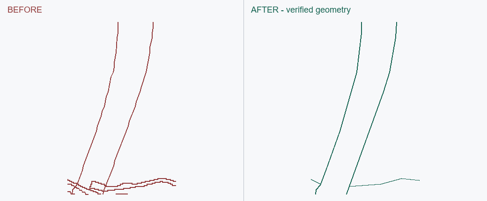

# EF006 · 桥面被低优先边线切碎

触发：桥、道路、穿线、跨层、断路。

## 错误做法

桥面与桥下地块分别闭合就认为可用，把所有图层平铺在 Z0 后仍留下桥面内部边。

## 正确处理与检查

默认前期平面按可见分区裁除桥面内低优先边；主路必须有宽度、同面，保留真实跨层关系。完整可见实体检查，不按图层豁免。

## 不可照搬的情况

详细高差任务另表达，不能把所有上下层道路都当同层路口。

## 已有案例与状态

### EF006-A

第二个场景：旧图两座主桥内干扰线合计约 1510 相对单位，修后为零；11 个主路观察点同面、六处宽度通过。原生文件数据检验有记录，桌面导入与鼠标选面未测。

状态：`geometry_verified`；SU：`native_data_verified`。此状态只属于该变体及文件版本。

实际历史 CAD 的局部重绘，左右同一裁剪范围与尺度；不含底图，不是新修复或原生 SU 截图。

关联流程：[su-plan-contract](../../su-plan-contract.md)、[shared-rules](../../shared-rules.md)。
