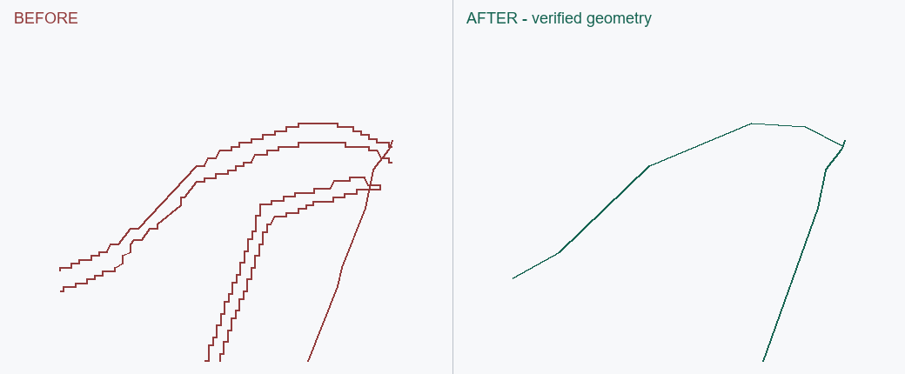
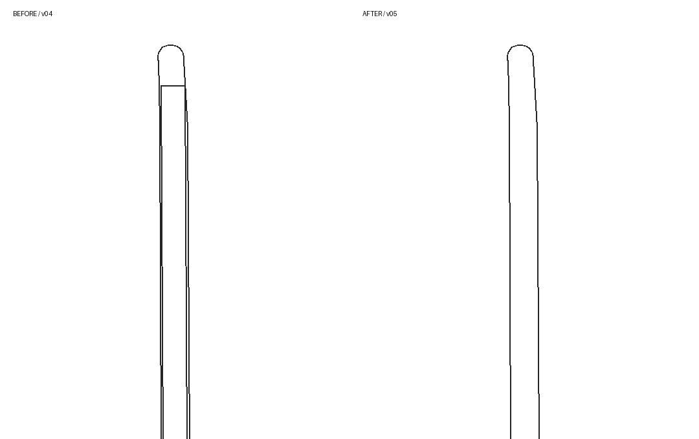

# EF007 · 岸界多线夹出无用途窄带

触发：岸线、水陆、平行线、窄带、水花。

## 错误做法

同时保留岸顶、岸脚、亮带等每条线，形成许多不能独立使用的细长面。

## 正确处理与检查

默认只留一条有作用水陆边界；无独立用途岸带归并。用源图独立横断检查边界条数，不能只检查总面数。

## 不可照搬的情况

有实际通行/设计用途的栈道、岸上地块、真实桥必须保留；详细高差按用户要求。

## 已有案例与状态

### EF007-A

第二个场景：指定西岛岸线横断从七条边变为一条；实际旧新 CAD 局部对照，不是整幅影像。

状态：`geometry_verified`；SU：`native_data_verified`。此状态只属于该变体及文件版本。

实际历史 CAD 的局部重绘，左右同一裁剪范围与尺度；不含底图，不是新修复或原生 SU 截图。

关联流程：[su-plan-contract](../../su-plan-contract.md)、[shared-rules](../../shared-rules.md)。

## EF007-B · 中央分隔带被加上多余种植内圈

道路中的真实长条分隔带被额外套一圈种植边，夹出无独立用途的细面和端部横线。用户指出不是双层结构。默认前期平面按实际需要保留唯一有效外轮廓，内部同一对象归并；不以颜色差、路缘亮带或树荫推出新结构层。

回归检查针对整条带：原始完整线网恢复为一个预期面，端部与中段同面，内部没有残留纵边或横向封口，外缘和相邻车行道保持。历史旧版南北带分别被拆成多个面，修订各为一个面、内部边长为零；面数及数值仅属于本项目。

适用边界：真实有用途的人行空间、站台、可通行中带或用户要求详细池壁/高差时保留必要细分，不能看到双线就删。仅同色或同标高不足以决定合并。

状态 geometry_verified；user_acceptance basically_accepted_scoped；native_sketchup not_run。

实际 CAD 回读局部前后对照，无底图；同一裁剪范围和尺度。
