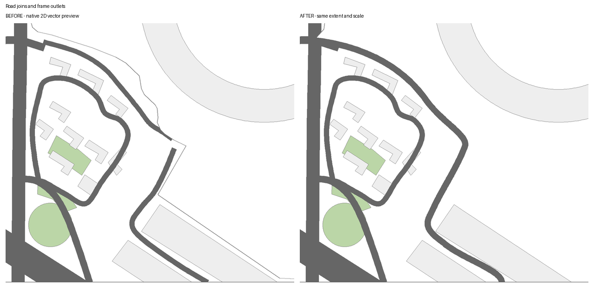
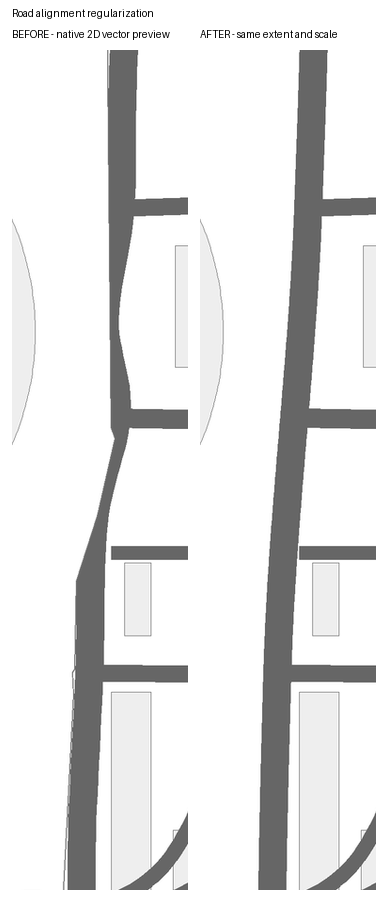

# EF008 · 图框接边、漏节点与伪闭合

触发：图框、端点、开环、重边、T节点、交叉。

## 错误做法

检查前先自动节点化、吸附，再用修好的临时几何证明原始导出可封面；单点接框也当作有效截边。

## 正确处理与检查

直接检查实际原生端点与完整线网；源图真截边保留线段接框，共边唯一。修复写入 CAD 后重新检查，父块和子对象逐面对应。

## 不可照搬的情况

实际开放参考线不等于建筑开环；曲线/共边表示须用适用的等效检查，不能改成假多边形凑通过。

## 已有案例与状态

### EF008-A

历史真实失败包含 86 处未节点化交点及三组重复边；另有截边退化成点接框的失败和对应回归测试。

状态：`historical_record`；SU：`not_run`。此状态只属于该变体及文件版本。

关联流程：[cad-modules](../../cad-modules.md)、[acceptance](../../acceptance.md)。

## EF008-B · 规则形体被航拍细描成碎折线

近俯视广场的规则圆角块面被按影像描出多段小折线。用户明确认可前期推拉模型优先使用规则直边、圆角和适度规整，手绘线只说明意图，不作为精确标准答案。

可复用经验是：从可信地面锚点确定主方向与规则形体，统一构造圆角、直边及共享端点；记录偏移预算，检查入口、净宽和邻块。不能强制所有块面正方形/等半径，不能忽略真实凹口，也不能将折线或原生圆弧中的某一种包装成普遍解决封面的保证。

状态：`historical_record`；`method_acceptance: confirmed`；`user_acceptance: method_only`。后续实际封面/联动问题未解决，本条不认证修复后的 SU 使用。原生端点或表示形式只作为排查项，不据截图认定根因。详见 [规则几何](../../hierarchy-and-regular-geometry.md)。

## EF008-C · 范围裁切后的断路、波折与接框碎块

大尺度园区的二维清空稿，独立道路段与范围遮罩分别构造，裁切后出现外围道路断口、接段错位、微小反复波折和图框边楔形。旧检查仅验证范围内无残留、范围外无变化，不能识别原基线已带入或裁切新造成的道路质量问题。

修法：以连续道路走向统一构造两侧，清空范围与保留道路共享边界；概括不影响主要分区的微小波折，完整宽度接框，清除无用途的窄带和残线；修路后必须回查建筑占地和其他支路，不能拿缩路、裁楼或填碎片替代修复。真实曲折、独立分隔及道路尽端不机械拉直。仅在本次授权局部调整，不复用项目坐标、尺度或固定弯道半径。

本例记录源矢量局部：道路由两个断开的面恢复为连续面；采样区的反复摆动消除，图框出口有非零完整宽度，保留建筑无新增重叠，授权修正区外不变。二维结果通过已执行的几何检查和视觉复查；真实 DWG 回读、CAD 全线网分面与原生 SU 未运行，用户对修后图的验收仍待反馈。

状态：`geometry_verified`（仅二维源矢量）；`native_sketchup: not_run`；`user_acceptance: pending`。配图为实际二维矢量预览的同尺度局部前后对照，不是卫星原图或 CAD/SU 操作截图。

关联：[主动检查规则](../../shared-rules.md#简化后主动检查接续波折与图框尖角)、[设计范围](../../design-scope.md)。
