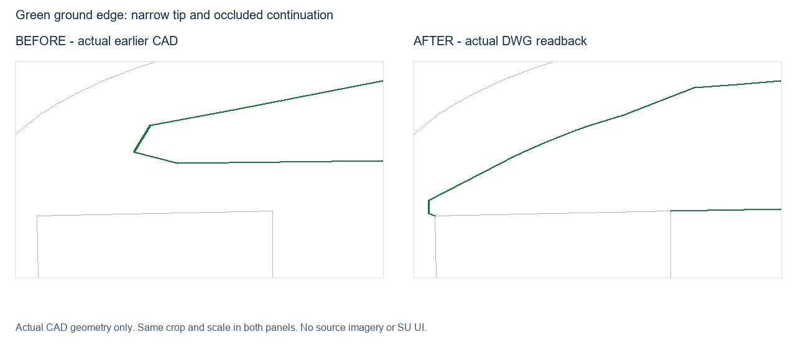
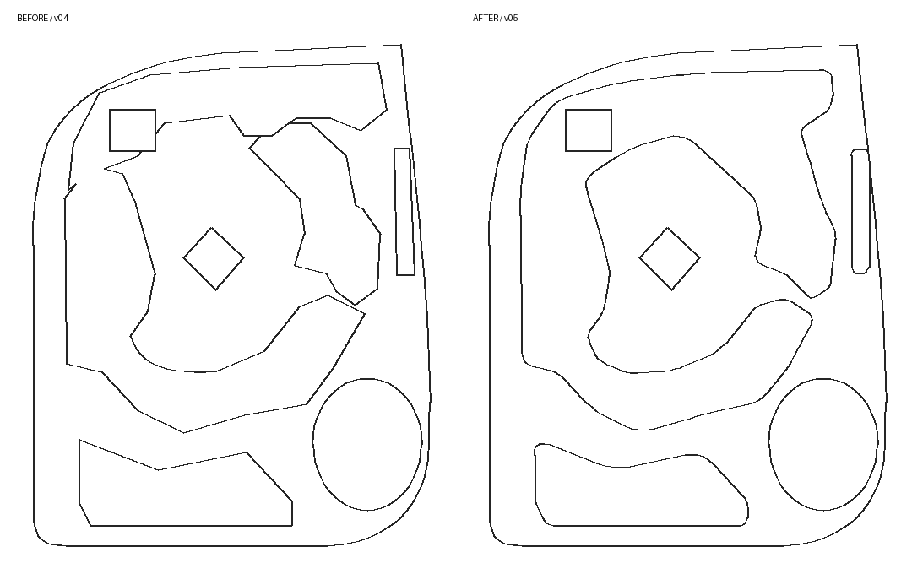

# EF011 · 冠幅或投影替代绿地地面边

触发：绿地、花池、池壁、树冠、冠幅、楔形、尖端、狭窄段、遮挡。

## 原因、修法与检查

树冠和屋顶投影被当成地面边，会让种植带外扩、楔形尖端截短，或漏掉树下铺装凹口。中小尺度及已授权详图区依据实体池壁、路缘、铺装—土壤交界重建；逐对象覆盖重要转折、尖端、狭窄段及遮挡续接。可见边和用邻接关系推断的边分开记录；常见花池形状不能取代现场依据。

用未标注原图建立边界点、内外点和邻接期望，再核对实际完整导出线网及局部叠图。手绘批注只提示问题；不从待检 CAD 或面索引倒推 expected。详见 [细节检查](../../site-detail-checks.md)。

## EF011-A · 遮挡楔形绿地与狭长种植带

实际旧版楔形绿地尖端和地面边不符；修订依据可见铺装—土壤边恢复狭长端部，遮挡边结合相邻接地边续接。邻近种植带和树下花池按地面边及铺装凹口复核修正，联动停车/铺装共边，外环和建筑基线保持。

同一组绿地边界采样及内外归属检查在旧版 2 项失败、新版 2 项通过。面索引已核对到实际旧/新原生线网恢复面；索引不是源图真值。项目另有种植带与中央花池的视觉记录，未把这些视觉推断扩写成逐边精确量测通过。

状态：`geometry_verified`，仅指上述几何检查；`user_acceptance: pending`；`native_sketchup: not_run`。屋顶下与树下边仍有推断，几何通过不能证明其精确。用户反馈已重开旧局部结论，旧证据保留为 superseded；修订版也尚未获用户验收。

实际旧 CAD 与新 DWG 回读线网局部重绘，同裁剪范围和尺度，不含用户照片、原图或批注。强调色不表示通用类别真值。

## 适用边界

大尺度仍可概括环境绿地；本条不增设全图精修。清空版已授权删除的绿地不恢复。图中方向、轮廓、数值及沿建筑接续只属于该次证据，不成为下一场地模板。若只能见树冠而没有地面或邻接依据，保留待查或明确推断，不伪造可见边。

## EF011-B · 不规则花池被拼接成扭曲轮廓

前版将遮挡下候选点和多块种植多边形直接拼接，留下尖钩、细凹口、急折及绿地内部无用途边。几何闭合、少量原图点贴近仍可能出现这种错误。用户要求参照真实花池的形体逻辑整理，修订后基本接受。

先按原图锁定花池总体范围、可见池壁、主要方向/弧段、重要转折与通道开口；删掉无地面依据的碎凹口，重构主要几何，再做合理切接。相接同用途种植面需要确认真实连接，不能只因接触就合并。直边保持直，曲边有连贯曲率，真实尖端和折角保留；禁止对全图统一圆角或套用某个半径。

同时复核原图锚点、内外点、两侧步道法向宽度及端口，查看完整轮廓急折和狭颈，并检查受影响外边界与建筑仍为基线。转角数量是候选指标，不是通用审美阈值；不能靠放宽误差或只给原折线加圆角修补错误主形。

状态 geometry_verified；用户基本接受该修订版前期平面，遮挡边仍属推定，SU not_run。

实际 CAD 与 DWG 回读局部重绘，同视窗同尺度，不含私人照片。

## EF011-C · 铺装行道树被连成假绿带

内部复核发现：广场上成排行道树被冠幅或阴影连成连续种植带，原图并无连续池壁、土壤边或足够邻接依据。删除假带，保留连续铺装；真实可辨树池按用途保留，低清图不强制逐树细描。

状态 historical_record；修订场景用户基本接受。该删除有原图视觉依据和实际分面记录，不声称自动证明了每棵树的接地范围，SU not_run。
